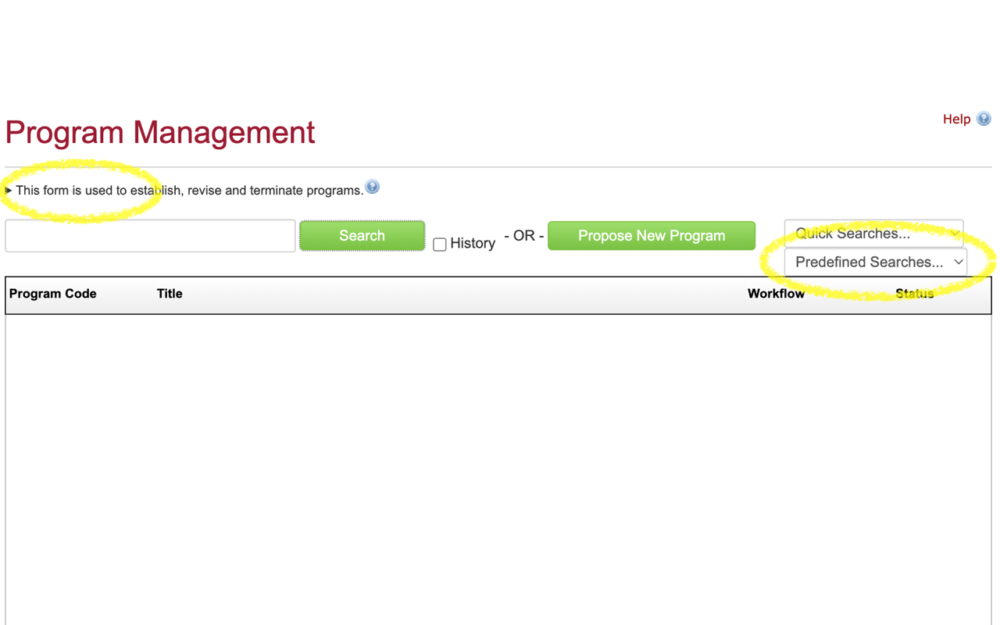

# moreinfo : UI tweaks in cim

Add predifined searches and simplify web page for Temple University Program Admin web page.

## Running this extension

1. Clone this repository.
2. Load this directory in Chrome as an [unpacked extension](https://developer.chrome.com/docs/extensions/mv3/getstarted/development-basics/#load-unpacked).
3. Navigate to https://nextbulletin.temple.edu/programadmin/rial/scripts-on-every-tab) for the full instructions.
